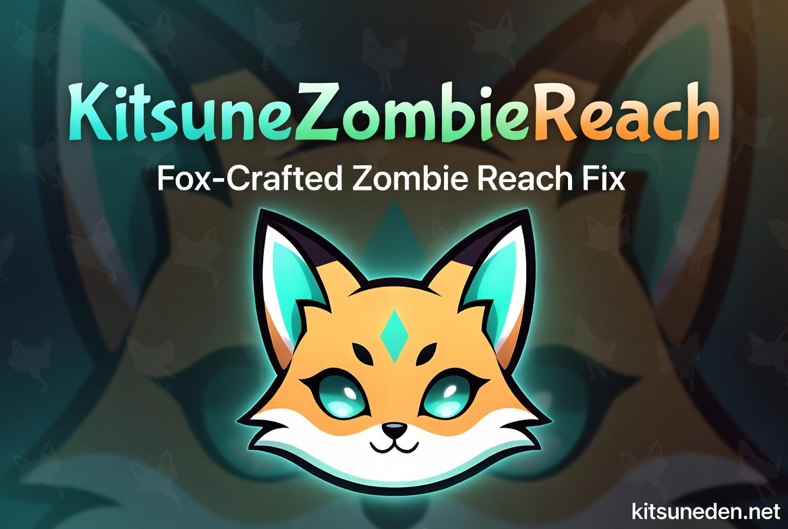

# KitsuneZombieReach

🦊 **Part of the [Kitsune Systems Collection](https://github.com/Kitsune-Den)** —
[KitsunePvPExtended](https://github.com/Kitsune-Den/KitsunePvPExtended) ·
[KitsuneTrapXP](https://github.com/Kitsune-Den/KitsuneTrapXP) ·
[KitsuneKitchen7D](https://github.com/Kitsune-Den/KitsuneKitchen7D) ·
[KitsuneFuelSaver](https://github.com/Kitsune-Den/KitsuneFuelSaver) ·
[KitsuneFoxacary](https://github.com/Kitsune-Den/KitsuneFoxacary)

**Shortens zombie melee reach in 7 Days to Die 2.x so hits land where the zombie actually is.**

You know that thing where a zombie slaps you from what feels like two meters away and you're pretty sure their arm didn't even move? Yeah. Part of that is server/client desync (which no mod can really fix without rewriting the netcode), but the other part is just that some zombie hand items have absurd reach values in the vanilla XML. 2.x pushed Boars up to 2.2m. Two point two meters. For a punch.

This mod tightens horizontal reach on every zombie hand item. Standard walkers, the big ones (Cop, Mutated, Rancher, Chuck), HazMats, Workers, Boars. Crawlers get a slightly harder nerf since they're already on the ground anyway. Hostile animals with absurd reach (Bears at 3.1m — *the same number as a Demolisher shoulder charge* — plus Dire Wolves and Mountain Lions) also get pulled into line.

It does NOT touch vertical reach. That's a different code path and a different problem. Maybe a future mod.

## Requirements

- 7 Days to Die V2.0+
- Server-side only. Install on the server (or in single player). Clients don't need anything.
- EAC-safe. Pure XML config patches, no DLL.

## Installation

1. Drop the `KitsuneZombieReach` folder from the release zip into your `Mods/` folder on the server.
2. Restart the server.

Done. No DLL, no Harmony, no client install.

## What it patches

All values are in meters. "Vanilla" is the stock 2.x value for that item; "Mod" is what this mod sets it to.

| Zombie group | Items | Vanilla | Mod |
|---|---|---:|---:|
| Standard walkers | `meleeHandMaster`, `meleeHandZombie01`, `meleeHandZombieShort`, `meleeHandZombieShortFeral`, `meleeHandZombieBurning`, `meleeHandZombieBurningFeral` | 1.4 - 1.65 | **1.375** |
| HazMat / Worker / PartyGirl | `meleeHandZombieHazMat`, `meleeHandZombieHazMatFeral`, `meleeHandZombieWorker`, `meleeHandZombieWorkerFeral`, `meleeHandZombiePartyGirl`, `meleeHandZombiePartyGirlFeral` | 1.65 (inherited) | **1.375** |
| Large zombies (Cop, Mutated x5, Rancher, Chuck) | `meleeHandZombieCop`, `meleeHandzombieMutated` + Feral/Radiated/Charged/Infernal, `meleeHandZombieRancher`, `meleeHandZombieChuck` | 1.7 - 1.75 | **1.55** |
| Crawlers | `meleeHandZombie02`, `meleeHandZombie02Feral`, `meleeHandZombieBurningCrawler` | 1.3 | **1.2** |
| Boar (zombie) | `meleeHandZombieBoar` | 2.2 | **1.8** |
| Hostile animals (Bear, Zombie Bear, Dire Wolf, Mountain Lion) | `meleeHandAnimalBear`, `meleeHandAnimalZombieBear`, `meleeHandAnimalDireWolf`, `meleeHandAnimalMountainLion` | 2.2 - 3.1 | **1.8** |

Quick note on how the table works. `Extends` chains mean Feral/Charged/Infernal variants that don't override `Range` inherit from their parent, so patching the parent cascades to them automatically. That's how Rancher, Chuck, Cop, and the whole Mutated family are covered. HazMat/Worker/PartyGirl needed explicit `append` patches because TFP forgot to give them their own `Range` property, so in vanilla they silently inherited Master's 1.65. Not by design, just sloppy.

## What it does NOT touch

- `meleeHandZombieStrong` / `Demolition` (3.1m shoulder charge, that's the whole point of those)
- `meleeHandBossGrace` (2.4m, she's a boss, she's allowed)
- Wolf, Coyote, Snake, Little Bear cub (1.2-1.7m, not egregious)
- Passive animals

## Credits

Inspired by [KhaineGB's Zombie Reach Adjustment](https://www.nexusmods.com/7daystodie). The idea of tightening zombie reach to make melee feel fair is his, and he did it first. Values and item list in this mod are our own (researched against current 2.x `items.xml`), and coverage has been extended to cover the new Rancher and Chuck zombies, HazMats, Workers, PartyGirls, Boars, and crawlers, none of which Khaine's version covers.

Made by AdaInTheLab.
